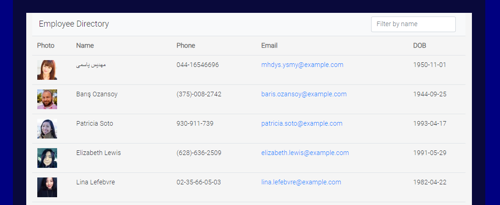

# Employee Directory

    

## Table of Contents
 * [Description](#Description)
 * [Installation](#Installation)
 * [Usage](#Usage)
 * [License](#License)
 * [Contributing](#Contributing)
 * [Questions](#Questions)
    
 ## Description
 Unit 19 React Homework: Employee Directory.
 application's UI into components, manage component state, and respond to user events.
 Users can view non-sensitive data about other employees and can filter employees by name.

 ## Installation
 View deployed application here: [https://tgeorge-employee-directory.herokuapp.com/](https://tgeorge-employee-directory.herokuapp.com/)

 ## Usage
 When the user loads the page, a table of employees will render which can then be filtered by name. 

 ## License
 undefined

 ## Contributing
 undefined

 ## Questions
 
      
    
 ## Email
  taneishalg@gmail.com